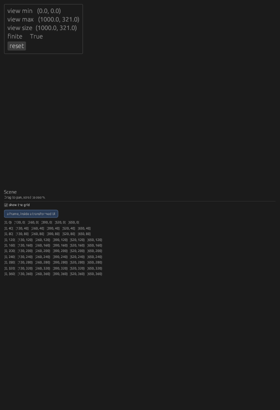
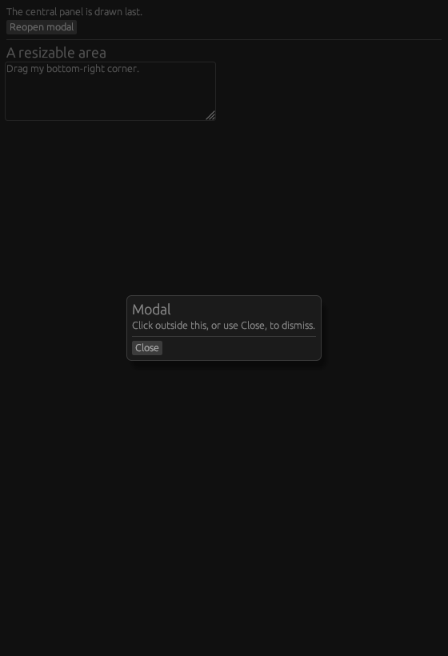
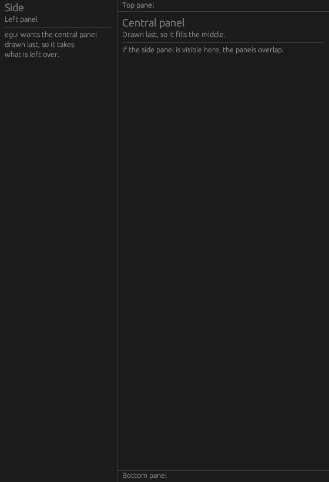
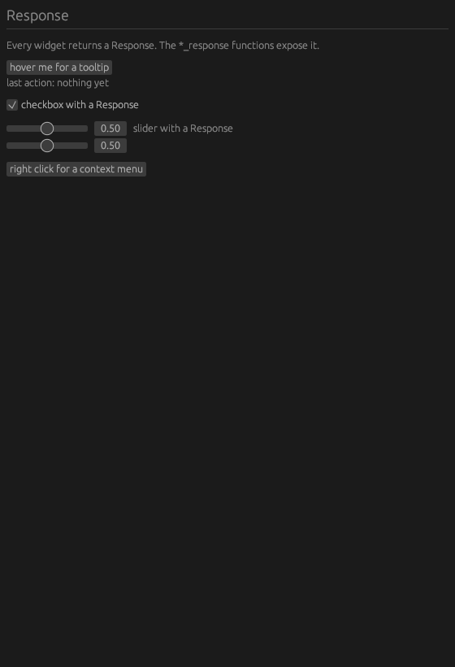
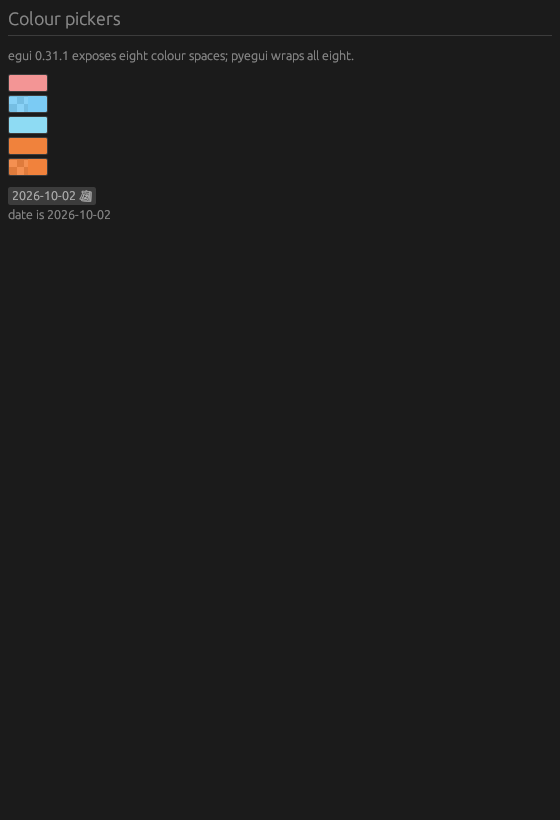
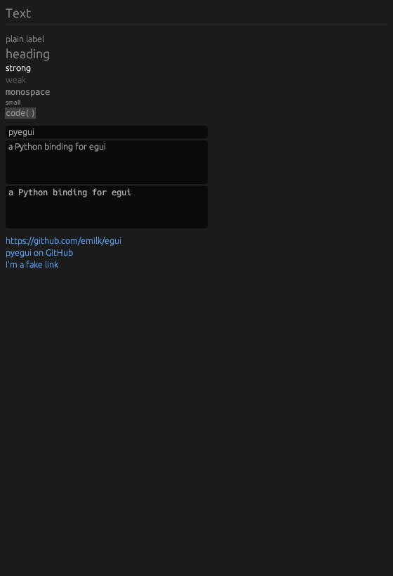
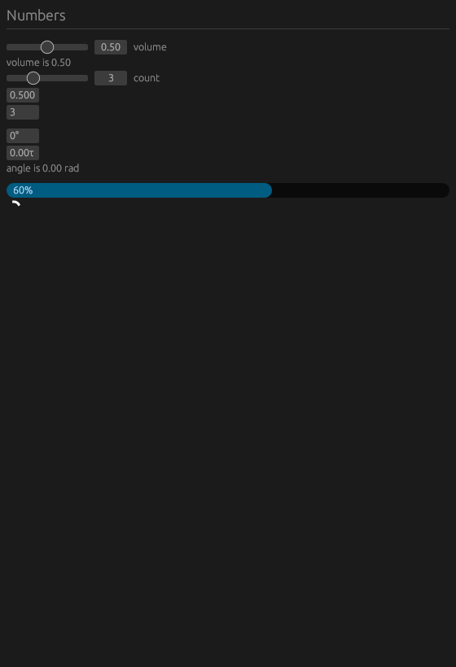
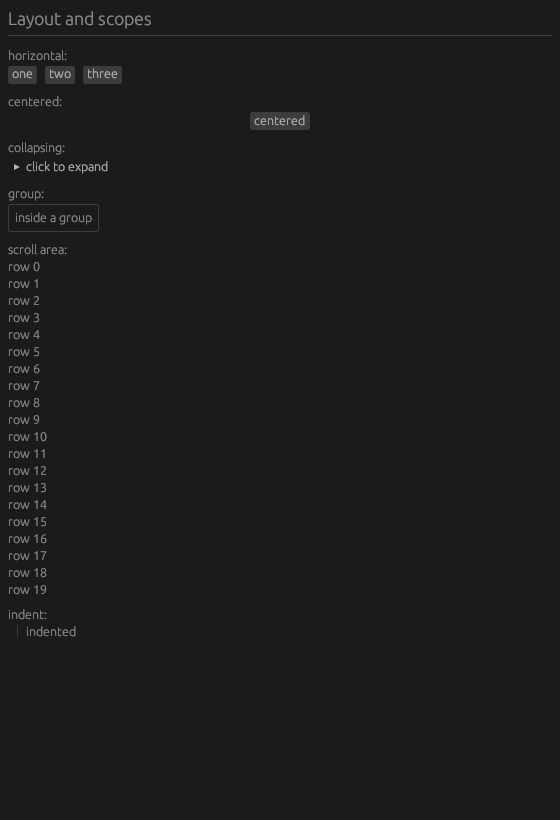

# pyegui

**pyegui** is a native extension for Python that provides bindings for
Rust immediate mode GUI library
[egui](https://github.com/emilk/egui).

## Example

```python
from pyegui import *

name = Str("Van")
age = Int(24)

def main_contents():
  heading("My egui Application")
  text_edit_singleline(name, hint_text="Your name")
  slider_int(age, 0, 150, "age")

  if button_clicked("Increment"):
    age.value += 1

  heading(f"Hello '{name.value}', age {age.value}")
  image("file://image.png", max_width=350, max_height=250)

def update_func(ctx):
  # egui draws nothing until a container is asked for. Panels are
  # independent, so you choose which ones exist and in what order --
  # CentralPanel takes the space that is left over.
  central_panel(ctx, main_contents)

if __name__ == "__main__":
  run_native("My pyegui Application", update_func)
```
|example 1| |example 2|

## Features

**pyegui** tries to be as close as possible to the original egui API,
but with the focus on simplicity and usability. Callbacks were removed
where possible to accomplish more smooth experience in Python.

- Light and Dark themes(defaults to the system's)
- Built-in latin and cyrillic alphabets. You can load any font you want
  with `ctx.set_font` function
- Images(png, jpeg, svg, gif, webp, and anything the `image` crate
  decodes)
- Date picker
- Colour pickers in every egui space: RGB, RGBA (premultiplied and
  unmultiplied), SRGB, HSVA, and the alpha variants
- `Response` for every widget that has one, so hover, focus and drag state
  are reachable -- as `*_response` variants, or `ctx.hovered()` and friends
- Containers: `central_panel`, `window`, `side_panel_left` /
  `side_panel_right`, `top_panel` / `bottom_panel`, `modal`, `area`
  and `resize`. egui draws nothing until the frame asks for one, so an app
  composes its own
- Menus: `menu_button` with nested submenus, plus `close_menu`
- Frames: `frame` and egui's eight presets, `frame_group` through
  `frame_side_top_panel`
- Text fields, radio buttons, buttons, code, progress bar etc.
- Scroll areas on either or both axes, collapsing sections, groups and scopes
- No dependencies which destroy you project when you distribute it. Just
  pure giant Rust binary

The API surface is **174 names** today: 18 classes, 156 functions and 46
`*_response` variants. This number comes from the `check` job, which builds
the wheel and asserts the module's exports against
[tests/expected_exports.py](https://github.com/ChetanKnowIT/pyegui/blob/main/tests/expected_exports.py)
in both directions, so it cannot drift from the code silently.

Full list of implemented features, and what egui can still do that pyegui
cannot, is in [TODO.md](https://github.com/ChetanKnowIT/pyegui/blob/main/TODO.md).

## Roadmap

### Upstream egui versions

pyegui wraps egui through Rust crates, so its feature set is bounded by
the egui release it is pinned to.

| pyegui | egui | eframe | Notes |
| --- | --- | --- | --- |
| 0.5.1        | 0.31.1     | 0.31.1       | current release       |
| — | 0.32.x | 0.32.x | not adopted yet |
| --- | --- | --- | --- |
| —            | 0.33.x     | 0.33.x       | not adopted yet       |
| — | 0.34.x | 0.34.x | not adopted yet |
| --- | --- | --- | --- |
| —            | 0.35.x     | 0.35.x       | not adopted yet       |
| planned | 0.36.2 | 0.36.2 | current egui release |
| --- | --- | --- | --- |

pyegui is five egui minor releases behind. egui 0.36 requires Rust 1.95
(0.31 required 1.81), so the upgrade also means a newer toolchain.

### Available now

- Text: `heading`, `label`, `monospace`, `small`, `strong`,
  `weak`, `code`, `code_editor`
- Input: `text_edit_singleline`, `text_edit_multiline`
- Buttons and links: `button_clicked`, `small_button_clicked`,
  `link_clicked`, `hyperlink`, `hyperlink_to`,
  `image_and_text_clicked`
- Selection: `checkbox`, `toggle_value`, `radio_value`, `radio`,
  `selectable_value`, `selectable_label`, `combo_box`
- Numbers: `slider_float`, `slider_int`, `drag_float`, `drag_int`,
  `drag_angle`, `drag_angle_tau`, `progress`
- Colour: `color_edit_button_rgb`, `_srgb`, `_srgba`, `_hsva`,
  `_rgba_unmultiplied`, `_rgba_premultiplied`,
  `_srgba_unmultiplied`, `_srgba_premultiplied` — every colour space
  egui 0.31.1 offers
- Dates: `date_picker_button`
- Images: `image` (`max_width` / `max_height`)
- Layout: `horizontal`, `horizontal_centered`, `horizontal_top`,
  `horizontal_wrapped`, `vertical`, `vertical_centered`,
  `vertical_centered_justified`, `centered_and_justified`, `indent`
- Scopes: `collapsing`, `collapsing_response`, `group`, `scope`,
  `scroll_area_vertical`, `scroll_area_horizontal`,
  `scroll_area_both`, `Layout` / `LayoutType`, `Group`
- Frames: `frame`, `frame_group`, `frame_popup`, `frame_menu`,
  `frame_window`, `frame_canvas`, `frame_dark_canvas`,
  `frame_central_panel`, `frame_side_top_panel`
- Pan and zoom: `scene`, with a `Rect` to hold the visible region
- Layout: `columns` (one callable per column), `end_row`,
  `set_row_height`, and the existing `horizontal` / `vertical` family
- Sizing: `set_width`, `set_height`, `set_min_width`, `set_max_width`,
  `set_min_height`, `set_max_height`, `set_min_size`, `set_max_size`,
  `set_width_range`, `set_height_range`, `shrink_width_to_current`,
  `shrink_height_to_current`
- Measurement: `available_size`, `available_width`, `available_height`,
  `cursor`, `min_rect`, `max_rect`, `min_size`,
  `pixels_per_point`, `next_widget_position`, `is_rect_visible`
- Ids: `push_id`, for giving repeated widgets their own state
- Menus: `menu_button`, `menu_image_button`, `menu_image_text_button`,
  `close_menu`
- Ui state: `disable`, `add_enabled`, `set_invisible`,
  `set_opacity`, `add_space`, `separator`, `close_menu`
- App: `run_native` with viewport kwargs, `Context` (theme, fonts,
  `open_url`, `copy_text`, `close`, `request_repaint`)
- State holders: `Str`, `Bool`, `Int`, `Float`, `Date`, `Rect`
- Colours: `RGB`, `RGBA`, `HSVA`, `Color32`, `SRGB`

Containers take egui's own builder options as keyword arguments, and an
unrecognised keyword raises `ValueError` naming every valid option rather
than being ignored. Geometry options take a number or a 2- or 4-sequence
(`default_size=(400.0, 300.0)`); colours take either a `Color32` or an
`(r, g, b, a)` tuple.

### Interaction state

egui returns a `Response` from every widget, carrying hover, click, drag,
focus and rect information. pyegui reaches it through the `*_response`
variants:

```python
from pyegui import *

name = Str("")
enabled = Bool(True)

def update_func(ctx):
    response = button_response("save")
    if response.clicked:
        print("saved")
    if response.hovered:
        response.on_hover_text("ctrl+s saves the file")

    if text_edit_singleline_response(name, hint_text="name").changed:
        print("name is now", name.value)

    if checkbox_response(enabled, "enabled").changed:
        print("toggled to", enabled.value)
```
The existing boolean helpers (`button_clicked` and friends) are unchanged,
so existing code keeps working. `Response` also carries `clicked_by`,
`drag_delta`, `has_focus`, `request_focus`, `context_menu`,
`on_hover_ui` and the rest of the 0.31.1 surface. A `Response` describes
one frame — read it in the same frame the widget was shown.

## Performance

pyegui is a binding, not a faster egui. Rendering is egui's work and identical
either way, so the only honest question is what the binding adds on top. Both
sides do the same work -- N labels per frame, 61 frames, timed around building
the frame -- and both were measured in one run of the `benchmark` workflow, on
one runner, over 5 trials each, so the rows are comparable with each other.
Figures are the median of the 5 trials; the range is every trial's ratio.

==================================  ========  ===========  =====  ===========  ========
widgets per frame                      pyegui  egui (Rust)  ratio  ratio range     extra
==================================  ========  ===========  =====  ===========  ========
50                                     0.600 us     0.453 us  1.33x    1.31x-1.34x  0.151 us
500                                    0.487 us     0.365 us  1.33x    1.33x-1.34x  0.121 us
2000                                   0.484 us     0.365 us  1.32x    1.31x-1.34x  0.117 us
==================================  ========  ===========  =====  ===========  ========

`import pyegui` is 7.3 ms -- that is `dlopen` of an 8 MB extension, and it is
the only startup cost the binding introduces.

**Read that as roughly 1.3x per widget, not "almost nothing".** A widget call
through Python costs about 0.12 us more than calling the same widget from
Rust.

The interesting part is that the ratio does not move. It was expected to: the
binding's cost is a fixed toll per call, so a frame with more widgets should
amortise it over more of egui's own work and the ratio should fall. Measured,
it sits at 1.32-1.33x at 50, 500 and 2000 widgets, and every one of the 15
trials landed between 1.31x and 1.34x. The binding is not a per-call tax that
widget density dilutes.

A 2000-widget frame takes 0.97 ms through pyegui and 0.73 ms in Rust. egui's
budget for 60 fps is 16.7 ms, so that frame uses about 6% of the budget
through pyegui and 4% in Rust -- both dominated by egui's own layout and paint.
The binding is not what a profiler would point at in a typical app. The
difference only becomes arguable somewhere in the tens of thousands of widgets,
not the thousands the table reaches.

Within a run the measurement is tight -- a spread of 0.8% to 2.3% on the
ratio. Between runs it is not: three earlier single-trial runs gave 1.30x,
1.52x and 1.38x-1.55x. That spread is variation between hosted machines, not
something about the binding, and it is why the trials exist.

The comparison is reproducible -- dispatch the `benchmark` workflow with
`widgets=50,500,2000` and `trials=5` and read `bench/results/combined.json`.
Trials are the outer loop and widget counts the inner, deliberately: the
reverse order measures 50 widgets on a cool machine and 2000 on a warm one,
and that gradient is indistinguishable from a real effect of widget count.
The combine step refuses to compute a ratio unless both sides report the same
widget count and the same number of frames, since the two halves have drifted
apart before and a ratio between different workloads looks exactly like a real
one. It is deliberately not a pass/fail gate, since a benchmark that gates a
build is a benchmark people learn to ignore.

**What is not claimed.** There is no "time to launch" figure: launch is
dominated by `dlopen` plus eframe's window creation, neither of which the
binding meaningfully changes, so such a number would mostly measure the window
system. There is no blended score either, since the per-widget cost is not
constant across the range and one figure would hide that.

> **Note**
>
> Measured on a GitHub-hosted runner, which is slower than a typical
> development machine. The ratio is the portable part; the absolute
> microseconds are not, and do not transfer between machines — the
> between-run spread above is what shows that. Earlier revisions of this
> section quoted 1.84x from a run measuring a single count, then 1.30x from
> another single-count run; this table supersedes both, and `git log` on this
> file has the change.

##### The ergonomics comparison

Timing is the weaker half of the argument. The stronger half is that pyegui does
not ask you to learn a second API -- `bench/hello_egui.rs` and
`bench/hello_pyegui.py` are the same app, and `Response` in the Python
version is egui's `Response` rather than a redefinition of it:

```rust
let clicked: egui::Response = ui.button("click me");
if clicked.clicked() {
    self.clicks += 1;
}
```
```python
if button_clicked("click me"):
    clicks.value += 1
```
The same widgets, the same interaction state, no translation layer. The Python
version is shorter mostly because the binding takes a callable where egui takes
a generic `impl FnOnce` -- not because it does less. What it costs is that
names have to be looked up rather than guessed; `TODO.md` records the three
that got guessed wrong while writing these.

## Screenshots

Every image below is rendered by `.github/workflows/screenshot.yml`, which
builds the wheel in CI, runs `examples/gallery.py` under Xvfb with Mesa's
software renderer, and captures each page. The same job doubles as a render
smoke test: a widget that compiles and imports but draws nothing fails it,
which the export gate cannot catch.

This file is Markdown, and that is the only form in which these images appear
at all. GitHub renders a `.rst` README as plain text inside a `<pre>` block: no
RST directive, no Markdown, and no raw HTML is processed, so a `figure`
directive and an `` link are equally invisible. Verified with
`gh api -H 'Accept: application/vnd.github.html'`, which returns zero ``
tags for the `.rst` version.

The Sphinx build reads this file through `myst-parser`, and the same
screenshots appear there as `.. figure::` directives on the
`docs/gallery.rst` page.



`scene`: drag to pan, scroll to zoom. The `view min` / `view max` readout is written by egui as the user interacts, not computed by the page -- which is why the `Rect` has to be the same object every frame.



`modal` returns `True` when the backdrop is clicked, and `resize` draws a box with a real resize grip. Both need an existing container: `modal` before the central panel, `resize` inside it.



Independent containers composed explicitly. egui asks for the side, top and bottom panels first, and `central_panel` last, which then takes whatever space is left over.



`Response`: hover tooltips, focus, context menus and change detection.



All eight egui 0.31.1 colour spaces, plus the date picker.



Text widgets, text fields and the code editor.


Selection widgets and the combo box.



Sliders, drag values, angle dials, progress and spinner.


Buttons, links and groups.



Layout containers: `Layout`, `Group`, `collapsing`, `scroll_area_vertical`, `indent`.


Ui state: `add_enabled` and `set_opacity`.

The images live in `docs/_static/`. To refresh them, push a change to
`examples/gallery.py`, download the `gallery-screenshots` artifact and
replace the files. The same gallery, with Sphinx-correct paths, is on the
`docs gallery page <docs/gallery.html>`_.

### Not available yet — planned

Ordered roughly by value per unit of work. "egui" names the upstream
API this would wrap.

**Layout and sizing** — the remaining part

- `with_layout`, `wrap_mode`, `wrap_text` — `with_layout` takes a whole
  `egui::Layout`, which the existing `Layout` / `LayoutType` classes do
  not cover
- `UiBuilder` / `scope_builder` / `new_child`
- `Painter` access — no custom painting, shapes or text layout
- `unique_id`, `next_auto_id`, `auto_id_with` — these return egui's
  `Id`, which has no Python equivalent and nothing useful to do in Python

**Context API** — see below

**Missing Context API**

egui's `Context` exposes 148 public methods; pyegui reaches 10.

- Input state: `input`, `is_pointer_over_area`,
  `wants_keyboard_input`, `wants_pointer_input`,
  `pointer_hover_pos`, modifiers — you cannot read the keyboard or mouse
  directly today
- `request_repaint` (and the `_after` / `_of` variants)
- `memory` / `memory_mut`
- `style`, `visuals`, `spacing`, `set_style`, `set_visuals` —
  no way to customise widget appearance
- Animations: `animate_bool_with_time`, `animate_value_with_time`
- `viewport` commands, `set_zoom_factor`, `set_pixels_per_point`
- `load_texture` / `try_load_bytes` / custom image loaders
- `set_cursor_icon`, debug hooks

**Missing widgets**

- `colored_label` — needs `Color32` and `RichText` wrappers
- `ComboBox` as a widget (only pyegui's hand-rolled `combo_box`
  exists), including `width`, `wrap`, `icon`, `popup_style`,
  `from_id_salt`
- `Table` / `TableBuilder` from `egui_extras` — no data grids
- `StripBuilder` and `Sizing` from `egui_extras`
- Syntax-highlighted code view (the `egui_extras` `syntect` feature
  is not enabled)
- `svg_text` (selectable SVG source), `RetainedImage`
- Drag and drop: `dnd_drag_source` / `dnd_drop_zone`. The payload
  methods on `Response` are also deferred: `dnd_set_drag_payload`
  takes `Arc<dyn Any + Send + Sync>`, which has no clean Python
  mapping.

**Builder options still missing on existing widgets**

`Slider`, `DragValue`, `TextEdit`, `DatePickerButton` and `run_native`
now forward every builder option egui 0.31.1 gives them, and an unknown
option name is a `ValueError` rather than a silent no-op. What is left
is the set egui cannot hand to Python as it stands:

- `Slider` / `DragValue`: `custom_formatter` and `custom_parser`.
  These are Rust closures, so a Python callable would need a trampoline
  and a lifetime strategy to reach one. egui's own `binary` / `octal` /
  `hexadecimal` are defined in terms of those two, so they are the
  supported way to change the format.
- `TextEdit`: `font` (needs a `TextStyle` class, see above) and
  `return_key` (needs `KeyboardShortcut` and `Key`).
- `DatePickerButton`: `start_end_years`. There is no setter for it at
  any version of egui_extras 0.31.1 -- the year range is hardcoded
  inside the popup's own draw, and the popup's fields are
  `pub(crate)`.
- `Button`: `selected`, `min_size`, `atoms`, `shortcut_text`, `wrap`
- `Image`: `tint`, `size`, `fit_to_exact_size`, `rotate`, `uv`,
  `corner_radius`, `sense`, `alt_text`
- `ProgressBar`: text, `animate`
- `eframe` `NativeOptions`: renderer choice, `glow_options`,
  `wgpu_options`, `depth_buffer`, `dithering`, and `App::save` (state
  persistence). The two renderer option structs are large nested
  configuration, and half of each is irrelevant depending on which
  renderer is in use.

Three names are on no list here, because egui 0.31.1 has no such
option: `movable_by_background` and `monitor` on the viewport --
`drag_and_drop` and `clamp_size_to_monitor_size` are the real things
nearby -- and `has_shadow`. They are rejected as unknown option names
rather than silently accepted.

### Upgrade path to egui 0.36

These are the concrete blockers found while comparing `src/lib.rs`
against egui 0.36.2. They are why the version bump is a project, not a
one-line `Cargo.toml` edit.

1. **MSRV**: egui/eframe 0.36 require Rust 1.95 (0.31 needed 1.81).
2. **`eframe::App` trait split (0.34)**: `App::update` was replaced by
   `fn ui(&mut self, ui: &mut Ui, frame: &mut Frame)` plus `fn logic`.
   `PyeguiApp` implements `update`, so it must be rewritten around the
   `&mut Ui` that eframe now hands it.
3. **`Context::run` → `Context::run_ui` (0.34)** and `Ui: Deref<
   Target = Context>`. The global `UI` pointer stack in `lib.rs` can
   stay, but it needs to key off the passed-in `Ui` rather than a
   stashed pointer.
4. **Atoms (0.32)**: `Button`, `Checkbox`, `RadioButton` and
   `selectable_value` take `impl IntoAtoms`. String-based calls still
   compile, but any wrapper meant to accept image+text needs porting.
5. **Popup rewrite (0.32)**: `Popup`, `PopupAnchor`,
   `PopupCloseBehavior`. Existing popup-ish code (`combo_box`,
   `date_picker_button`) needs rechecking.
6. **Date type change**: `egui_extras` 0.36 datepicker uses
   `jiff::civil::Date`; 0.31 used `chrono::NaiveDate`. The pyegui
   `Date` class wraps `NaiveDate`, so it must move to `jiff` (or
   keep `chrono` and convert).
7. **Font rendering (0.34)**: `ab_glyph` → `skrifa` + `vello_cpu`,
   plus a font-variations API. `Context.set_font` keeps working but
   gains options (families, variations).
8. **Colour spaces**: the full `color_edit_button_*` family is expected
   rather than RGB-only.
9. **MSRV-adjacent dependency bumps**: pyo3 0.24 is fine, but
   `image`, `log` and friends move with the egui release train.
10. **New upstream capabilities worth exposing once unblocked**:
    `egui::Plugin` (0.33), `Ui` classes via `UiBuilder` (0.35),
    the inspection protocol and `egui_mcp` (0.35), `BoxedWidget`
    (0.36), and window-chrome theme syncing (0.36).

### Deliberately not planned

- Rendering backends other than the eframe default. pyegui does not
  expose renderer selection.
- Custom Rust-side widgets defined by the user. pyegui targets a pure
  Python surface.
- Web/wasm targets, Android, and mobile input tuning.

## Contributing

pyegui is a Rust extension module, and this repository is developed
**without a local Rust toolchain** -- no `rustup`, no `cargo`, no
`docker`, and no `maturin` in the venv. GitHub Actions is therefore the
only place pyegui is ever compiled, and every build claim in a pull request
must come from an actual workflow run rather than a local invocation.

The full setup, including the per-push `check` gate, the lockfile
regeneration workflow, and which `Makefile` targets cannot run here, is
documented in `docs/development.rst` (published as "Development and CI"
in the documentation site).

In short:

- `check.yml` runs on every push to `main` and `feature/**`: `cargo
  check --locked`, advisory `cargo clippy`, a hard assertion that egui
  resolves to exactly 0.31.1, then `maturin develop` plus a Python import
  that asserts every expected export exists.
- `examples.yml` runs every app in `examples/`, `guides/` and
  `debug.py` under Xvfb, requires each to open a window, draw and exit, and
  runs every runnable README snippet. A capture is checked for drawn pixels
  rather than file size, so a sparse window is not mistaken for a blank one.
- `release.yml` publishes a GitHub Release only after `check` and
  `examples` both pass on the tagged commit.
- Push work to the `fork` remote; `origin` is read-only.
- Commit only once `check` is green.

```bash
git push fork feature/<name>
gh run list --repo ChetanKnowIT/pyegui --branch feature/<name>
```

## Install

Prebuilt binaries are provided for Linux, Windows and macOS. On other platforms
pip will build wheel for your OS. In this case you'll need Rust compiler
and [maturin](https://github.com/PyO3/maturin)

Install from pypi:

```bash
pip install pyegui
```

## Releases

Releases are published on the [releases page](https://github.com/ChetanKnowIT/pyegui/releases), with a changelog at
`CHANGELOG.md <CHANGELOG.md>`__. A release is only cut once `check` and the
`examples` job both pass on the tagged commit, so a published tag always
means the code compiled, the exports matched, and every example in the
repository ran and drew.

Install from source:

```bash
git clone https://github.com/gachilord/pyegui
pip install <path to pyegui>
```

## Usage

This is how you write a "hello world" app.

```python
from pyegui import *

def main_contents():
  # draw UI here
  heading("Hello, World!")

def update_func(ctx):
  central_panel(ctx, main_contents)

if __name__ == "__main__":
  run_native("Example app", update_func)
```
You can find more examples in the [documentation](https://gachilord.github.io/pyegui).

> **Note**
>
> **Changed in 0.5.1: `run_native` no longer opens a `CentralPanel` for
> you.** egui draws nothing until the frame is asked for a container, so
> `update_func` now composes its own frame with
> `central_panel(ctx, contents)` -- see the example above. This matches
> egui 0.31.1 directly. To update an existing app, wrap the code in your
> `update_func` in `central_panel(ctx, ...)`; nothing else changes. There
> is no compatibility shim. The full list is in `CHANGELOG.md
> <CHANGELOG.md>`__.

### Update functions

**pyegui** has a notion of update functions which the library calls to
draw your UI.

```python
def update_func(ctx):
  central_panel(ctx, main_contents)

def main_contents():
  # you can place here any widget
  heading("I'm a heading")
  # some widgets are interactive
  if button_clicked("I'm a clickable button"):
    # you can update state from here or show another widget
    print("Clicked")
```
The top level update function has the Context object that controls
global aspects of your app(e.g fonts and theme).

```python
def update_func(ctx):
  ctx.set_light_theme()
  central_panel(ctx, main_contents)

def main_contents():
  heading("Using light theme even if system's is dark")
```
Update functions may be nested. Such functions create a new UI scope
that can have different styles and behaviour.

```python
def update_func(ctx):
  central_panel(ctx, main_contents)

def main_contents():
  # define a nested function
  def nested():
    label("I'm a label inside nested update function")
    label("New label")
    disable() # this function will disable all further widgets in the scope
    if button_clicked("You can't click me"):
      print("Unreachable")
  # all the widgets inside 'nested' will be centered vertically 
  horizontal_centered(nested)
  # this widget won't be disabled though it goes after 'disable()'
  if button_clicked("You can click me"):
    print("Clicked")
```

### Containers

Containers is a syntactic sugar for code that needs update functions.
Function calls are replaced by Python's `with` statement.

The code that centers widgets vertically:

```python
def update_func(ctx):
  central_panel(ctx, main_contents)

def main_contents():
  def nested():
    label("I'm a label inside nested update function")
    label("New label")

  horizontal_centered(nested)
```
Can be written without callbacks:

```python
def update_func(ctx):
  central_panel(ctx, main_contents)

def main_contents():
  with Layout(LayoutType.HorizontalCentered):
    label("I'm a label inside nested update function")
    label("New label")
```

### Variables

Many widgets require access to a state via a reference, which can't be
done for integers, floats and strings in Python. That's why such helper
classes as Str, Bool, Int and Float exist.

They are essentially the following:

```python

# Example for bool type
class Bool:
  value = False
```
These classes can be used to draw UI or to store user input. You have to
create them outside of update functions.

```python
data = Bool(False)

def update_func(ctx):
  central_panel(ctx, main_contents)

def main_contents():
  heading(f"Value of the data is {data.value}")
  # button will be shown only if the checkbox is checked 
  if data.value and button_clicked("set to False"):
    # hiding the button
    data.value = False
  checkbox(data, "Check me")
```
.. |example 1| image:: https://github.com/GachiLord/pyegui/raw/main/example1.jpeg
.. |example 2| image:: https://github.com/GachiLord/pyegui/raw/main/example2.jpeg
